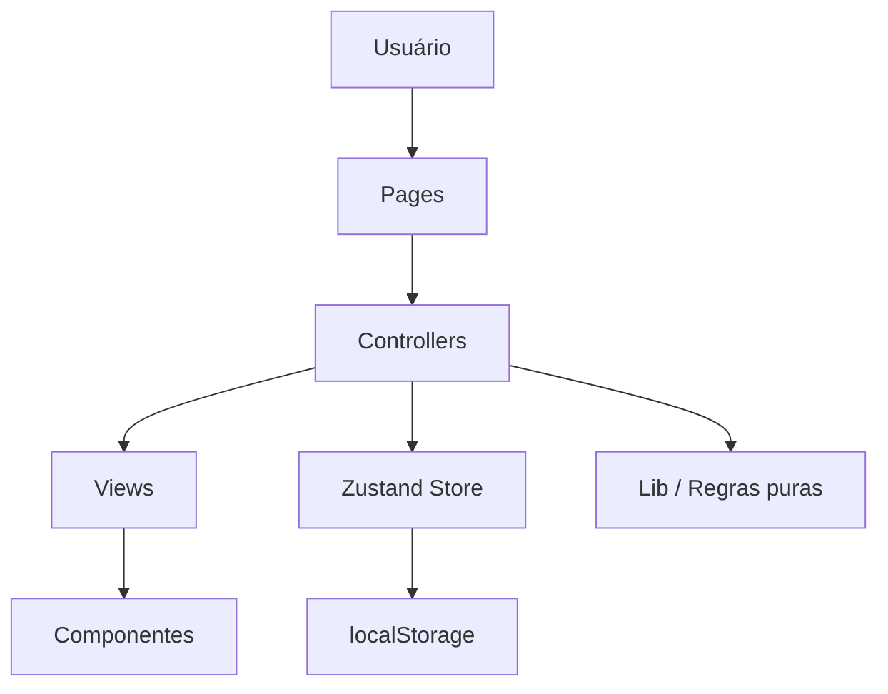
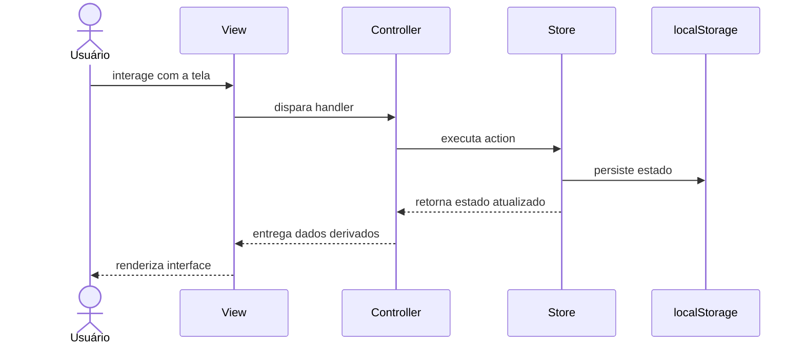
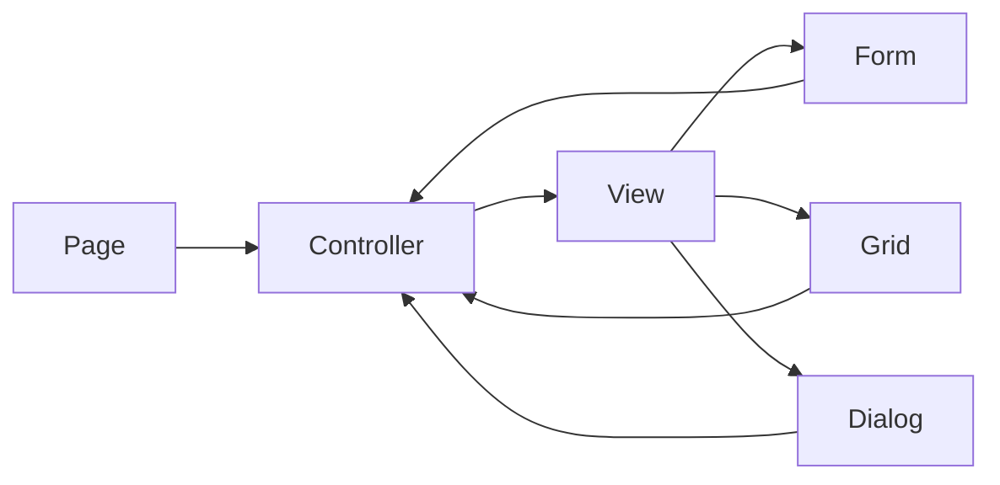
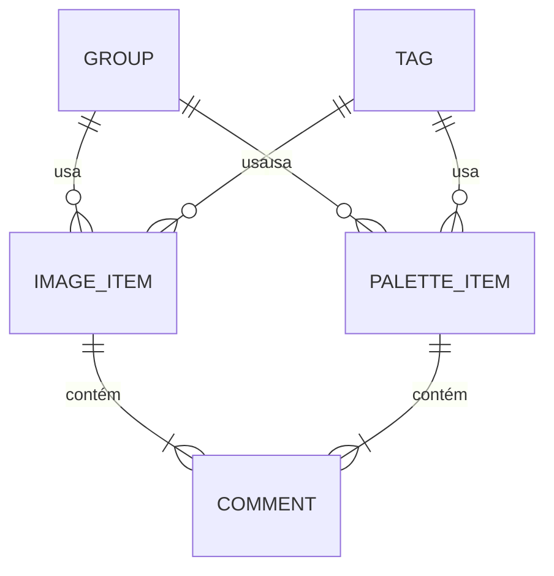

# Design de Sistema

Documento de alto nível do Pupila Brand Zone, frontend para gerenciamento local de referências visuais com fluxo de autenticação visual preparado para integração futura.

## 1. Arquitetura Geral

### 1.1 Diagrama de componentes da aplicação

### 1.2 Fluxo de dados entre componentes

### 1.3 Modelo de estado da aplicação

O estado foi dividido em duas camadas:

| Camada        | Conteúdo                                                                 | Tecnologia                 |
| ------------- | ------------------------------------------------------------------------ | -------------------------- |
| Global        | `images`, `palettes`, `groups`, `tags`, `filters`                        | Zustand                    |
| Local de tela | dialogs, item em edição, item selecionado, exclusão pendente, `viewMode` | `useState` nos controllers |

Princípios:

- estado de domínio compartilhado fica no store;
- estado transitório de interface fica no controller;
- listas filtradas e buscadas são dados derivados, não nova fonte de verdade.

## 2. Componentes Principais

### 2.1 Descrição dos principais componentes da interface

| Componente                  | Papel                                             |
| --------------------------- | ------------------------------------------------- |
| `AppShell`                  | layout raiz, cabeçalho e navegação                |
| `Page`                      | ponto de entrada da rota/tela                     |
| `Controller`                | orquestra estado, handlers e integração com store |
| `View`                      | composição visual principal da tela               |
| `ImageGrid` / `PaletteGrid` | listagem principal dos itens                      |
| `PaletteList`               | visualização compacta de paletas                  |
| `PaletteDetailsList`        | visualização expandida de paletas                 |
| `PaletteViewModeControl`    | alternância entre modos de visualização           |
| `ImageForm` / `PaletteForm` | criação e edição                                  |
| `GroupList` / `TagList`     | gerenciamento de taxonomias                       |
| `FiltersToolbar`            | busca textual e filtros                           |
| `CommentsList`              | exibição e edição de comentários                  |
| `DeleteConfirmationDialog`  | confirmação de exclusão                           |
| `AuthPageShell` / `AuthCard`| composição visual de login e cadastro             |

### 2.2 Responsabilidades de cada componente

#### `AppShell`

- renderiza o layout global;
- controla navegação entre módulos;
- expõe ações globais de navegação.

#### `Page`

- monta o controller da tela;
- injeta o controller na view.

#### `Controller`

- integra React com Zustand;
- concentra `useState`, `useMemo` e handlers;
- controla dialogs, edição, filtros e orquestração da tela.

#### `View`

- recebe o controller nomeado;
- monta a interface;
- distribui props para componentes filhos;
- não acessa store diretamente.

#### Componentes específicos

- formulários coletam entrada e submetem dados validados;
- grids e listas exibem entidades;
- a feature de paletas suporta múltiplos modos (`grid`, `list`, `details`) sem alterar o estado persistido;
- dialogs encapsulam fluxos de criação, edição e exclusão;
- barra de filtros concentra busca e seleção por grupo/tag.

### 2.3 Interações entre os componentes

Regras de interação:

- a `Page` conhece o controller e a view;
- a `View` conhece apenas o controller recebido por prop;
- componentes filhos recebem apenas dados e callbacks necessários;
- store e persistência ficam fora da camada visual.

## 3. Estratégia de Gerenciamento de Dados

### 3.1 Como os dados serão estruturados

Entidades principais:

- `ImageItem`: imagem, título, URL, grupos, tags, comentários e datas;
- `PaletteItem`: título, cores, grupos, tags, comentários e datas;
- `Group`: agrupador reutilizável;
- `Tag`: classificação reutilizável;
- `Comment`: observação textual com data de criação/edição.

Relacionamentos:

- imagens e paletas referenciam grupos e tags por `id`;
- comentários ficam aninhados no item visual;
- a modelagem é simples e adequada ao escopo local do MVP.

### 3.2 Abordagem para persistência de dados

A persistência usa `localStorage`.

Fluxo:

1. o store tenta hidratar o estado ao iniciar;
2. caso os dados estejam ausentes ou inválidos, usa fallback seguro;
3. após mutações relevantes, o estado persistível é serializado e salvo.

Decisões:

- persistir apenas dados de domínio;
- não persistir estado transitório de interface;
- manter acesso ao storage isolado da UI.

### 3.3 Estratégia para busca e filtragem

A busca e os filtros são executados no cliente, a partir do estado bruto.

Busca textual:

- considera título;
- considera comentários;
- considera nomes das tags associadas.

Filtros:

- filtro por grupo;
- filtro por tag;
- combinação de busca e filtros ativos.

Implementação:

- regras puras em `lib`;
- composição final via `useMemo` nos controllers;
- sem duplicar resultado filtrado no store.
- o modo de visualização de paletas é tratado como estado de interface e não é persistido.

## 4. Decisões Técnicas

### 4.1 Tecnologias escolhidas e justificativas

| Tecnologia      | Justificativa                                       |
| --------------- | --------------------------------------------------- |
| React           | base sólida para interface componentizada           |
| TypeScript      | contratos explícitos e segurança de tipos           |
| Vite            | SPA com setup simples, build rápido e HMR eficiente |
| Tailwind CSS    | estilização utilitária consistente                  |
| shadcn/ui       | base acessível para componentes de interface        |
| Zustand         | estado global simples, com pouco boilerplate        |
| React Hook Form | gestão performática de formulários                  |
| Zod             | validação declarativa e tipada                      |
| Jest + RTL      | testes unitários e de integração relevantes         |
| `localStorage`  | persistência simples e adequada ao MVP local        |
| `dayjs`         | formatação de datas com locale pt-BR                |

#### Por que Vite e não Next.js

A escolha do Vite foi deliberada e alinhada ao escopo do projeto.

Motivos principais:

- a aplicação é uma SPA local-first, sem backend real;
- não havia necessidade de SSR, SSG, Server Actions, API Routes ou cache no servidor;
- toda a persistência acontece no navegador com `localStorage`;
- o fluxo principal é totalmente client-side;
- o Vite reduz complexidade operacional e acelera o ciclo de desenvolvimento.

Em resumo:

- **Vite** era a escolha mais proporcional ao problema;
- **Next.js** adicionaria capacidade que o MVP não precisava neste momento.

Decisão defendável:

> O projeto precisava provar arquitetura frontend, modelagem, interação e persistência local. Como não havia requisito de backend, renderização no servidor ou recursos full-stack, Vite entregava exatamente o necessário com menos overhead e maior foco no core do desafio.

### 4.2 Padrões de design aplicados

| Padrão                               | Aplicação                                                |
| ------------------------------------ | -------------------------------------------------------- |
| Page + Controller + View             | separa entrada de rota, orquestração e composição visual |
| Funções puras em `lib`               | busca, filtros, helpers e transformações sem React       |
| Factory Functions                    | criação padronizada de entidades com `id` e datas        |
| Store central com actions            | mutações previsíveis e persistência isolada              |
| Componentização por responsabilidade | formulários, listas, grids e dialogs focados             |

### 4.3 Considerações de desempenho e usabilidade

Desempenho:

- uso de selectors do Zustand para reduzir re-render desnecessário;
- uso de `useMemo` para derivar busca e filtros;
- carregamento tardio de imagens com `loading="lazy"`;
- ausência de camadas desnecessárias para o escopo do MVP.

Usabilidade:

- navegação simples entre módulos;
- telas de login e cadastro seguem a identidade visual do produto e antecipam a futura integração com backend;
- formulários com validação clara;
- confirmação antes de exclusões com modal dedicado;
- estados vazios informativos;
- contadores por página para reforçar visibilidade de estado;
- overflow controlado em grupos e tags com `+N`;
- exibição complementar do conteúdo excedente em hover;
- visualização avançada de paletas em grade, lista e detalhes para atender leitura densa e inspeção visual;
- contraste e foco visual preservados;
- interface estável em desktop e mobile.

Detalhes de interface considerados intencionalmente:

- **Empty states**: cada tela orienta o usuário quando não existem dados ou quando filtros não retornam resultado;
- **Modal de confirmação de deleção**: ações destrutivas passam por confirmação explícita;
- **Contadores por página**: imagens, paletas, grupos e tags exibem quantidade total no cabeçalho;
- **Cards com overflow controlado**: quando há muitos grupos ou tags, a interface resume o excesso em `+N` e revela o restante em hover;
- **Visualização de paletas**: o usuário pode alternar entre leitura em grade, lista compacta e detalhes sem sair da tela;
- **Autenticação simulada**: login e signup são simulados localmente para viabilizar o fluxo de navegação e análise do teste. Não há backend real, comunicação com servidor ou criptografia de senha. O estado do usuário é mantido apenas em memória durante a sessão, sem persistência de credenciais;
- **Consistência visual**: grids, listas, badges, dialogs e formulários seguem padrão previsível entre os módulos.

## Fechamento

O projeto foi estruturado para priorizar:

- clareza arquitetural;
- separação de responsabilidades;
- facilidade de manutenção;
- testabilidade;
- aderência ao escopo do MVP.

O resultado é uma SPA local-first com base organizada para evolução futura sem inflar a complexidade inicial.
